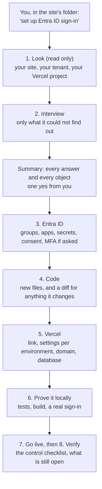

# entra-id-auth

[](https://github.com/BespokeWoodcraftStudio/entra-id-auth/actions/workflows/ci.yml)
[](LICENSE)

Microsoft Entra ID sign-in for a Next.js website on Vercel, set up end to end by your AI agent.

**Set it up with your AI agent.** In Claude Code (the terminal, the desktop app or an editor
extension) or any other coding agent, say:

```text
Go to https://github.com/BespokeWoodcraftStudio/entra-id-auth and do the setup.
```

**AI agent asked to do the setup, or to set up Entra ID sign-in before this skill is installed:**
fetch the raw file, word for word, with
`curl -fsSL https://raw.githubusercontent.com/BespokeWoodcraftStudio/entra-id-auth/main/SETUP.md`
(a fetch tool that summarises can drop lines), or clone this repository to `~/entra-id-auth`,
never inside a website's folder. Then follow SETUP.md top to bottom.

The agent follows [SETUP.md](SETUP.md): it checks your machine, installs what is missing on your
yes, signs you in to Microsoft and Vercel, and installs the skill. Then, in a website's folder:

| Agent | Say |
|---|---|
| Claude Code | start a new session and say "set up Entra ID sign-in on this site" |
| Any other agent | "Read ~/entra-id-auth/skills/entra-id-auth/SKILL.md and follow it for this site" |

- Locks the site to the people you choose in your Microsoft 365 tenant.
- Creates the security groups, app registrations, enterprise apps and consent it needs.
- Adds MFA for the site only if you say yes, and never touches your tenant-wide settings.
- Writes the Next.js and Better Auth code, the people list and the Vercel settings.
- Looks first, asks you a short set of questions, and shows every change before it makes it.

## How it runs



Every write follows the same rhythm: the plan prints the exact commands, you answer yes, no or
change something, and only a yes runs it.

## What you need

| Need | Detail |
|---|---|
| Microsoft 365 tenant | with Microsoft Entra ID; workforce accounts, one tenant |
| Entra ID P1 | for assigning a group to the app and for an MFA policy (P1, P2 or Microsoft 365 Business Premium). Without it the skill says so first and offers a roster with each person assigned directly |
| Admin roles | the least role per step, below; one person may hold them all |
| A Next.js site on Vercel | App Router; see the supported stack below |
| Command-line tools | `az` (Azure CLI), `vercel`, `node` 22.12+ on 22, 24, or 26 and later (24 recommended), `psql`, `createdb`, `dropdb`, `git`, `bash`, `openssl`, `curl` |
| A local Postgres server | 15 or later, running on this machine, for the local test before go-live. The default address `postgres://localhost:5432/<site>` connects as your computer's user with no password, and that user must be allowed to create databases. If yours needs a user and password, the skill asks for the address |
| Setup machine | macOS, Linux, or Windows through WSL |
| What it may cost | Entra ID P1 if you want a group on the app or an MFA policy; a Neon database has a free plan; your Vercel plan as it is |

| Step | Least Entra role |
|---|---|
| Look (read only) | any member |
| Groups | Groups Administrator |
| App registrations and secrets | Application Developer |
| Enterprise apps, assignment, consent | Cloud Application Administrator |
| MFA policy (only if you say yes) | Conditional Access Administrator |
| Mailbox reader (only if you ask for it) | Exchange Administrator |

More for the person who holds those roles: [docs/for-administrators.md](docs/for-administrators.md).

## Install

In a terminal:

```bash
claude plugin marketplace add BespokeWoodcraftStudio/entra-id-auth
claude plugin install entra-id-auth@entra-id-auth
```

Or inside a Claude Code session in a terminal:

```text
/plugin marketplace add BespokeWoodcraftStudio/entra-id-auth
/plugin install entra-id-auth@entra-id-auth
```

The `/plugin install` line may open the `/plugin` panel and ask where to install: pick the option for you
(user scope).

In the desktop app (+ > Plugins > Add plugin) or an editor extension (`/plugins`, then
Marketplaces), add `BespokeWoodcraftStudio/entra-id-auth`, then install `entra-id-auth` for you.
The `/plugin` lines above do not work there.

Already added? Do not run the add line again: it turns automatic updates off. Run
`claude plugin marketplace update entra-id-auth`, then
`claude plugin update entra-id-auth@entra-id-auth` (or the install line above, if it was never
installed).

After the command-line install, a session that was already open does not see the new skill.
Start a new Claude Code session in your site's folder (or type `/reload-plugins` in the open one),
then ask "Set up Entra ID sign-in on this site", or run `/entra-id-auth:entra-id-auth`.

### Updates

Updates are not automatic for third-party marketplaces unless you turn them on (SETUP.md step 5).
To get a new version, run both lines, in this order:

```bash
claude plugin marketplace update entra-id-auth
claude plugin update entra-id-auth@entra-id-auth
```

The first fetches the new catalog. Without it, the second still sees the old version as the latest
and says you are up to date.

Then start a new Claude Code session, or type `/reload-plugins` in one that is already open.

### Uninstall

```bash
claude plugin uninstall entra-id-auth@entra-id-auth
claude plugin marketplace remove entra-id-auth
```

The second line is optional; it also drops the catalog. Uninstalling changes nothing in your
tenant, your Vercel project or your site. To remove what a setup made, run the skill's `teardown`
step, which prints the delete commands for you to run.

### Without the plugin

Clone the repository once, to a folder outside every website:

```bash
git clone https://github.com/BespokeWoodcraftStudio/entra-id-auth ~/entra-id-auth
```

| Agent | Then |
|---|---|
| Claude Code | `d="${CLAUDE_CONFIG_DIR:-$HOME/.claude}/skills"; mkdir -p "$d" && cp -R ~/entra-id-auth/skills/entra-id-auth "$d/"`, start a new session in the site's folder, and run `/entra-id-auth` (or ask in plain words) |
| Any other agent | in the site's folder, tell it: "Read ~/entra-id-auth/skills/entra-id-auth/SKILL.md and follow it for this site" |

Update: run the checked block in [SETUP.md](SETUP.md) step 4 ("Not Claude Code?"), which pulls
only when `~/entra-id-auth` holds this repository. For Claude Code, then replace the copy it reads,
which a pull alone leaves as it was (the `rm` drops files a new version no longer has):

```bash
d="${CLAUDE_CONFIG_DIR:-$HOME/.claude}/skills"; [ -d ~/entra-id-auth/skills/entra-id-auth ] && rm -rf "$d/entra-id-auth" && cp -R ~/entra-id-auth/skills/entra-id-auth "$d/"
```

Uninstall: delete `${CLAUDE_CONFIG_DIR:-$HOME/.claude}/skills/entra-id-auth` (Claude Code), and
`~/entra-id-auth` if nothing else uses it.

Pick one for Claude Code: the plugin or this copy. Two copies with one name both load, and the
older one can answer. SETUP.md finds this copy and offers to remove it when it installs the plugin.

Do not copy the skill into the site's own folder. Its code templates would be type-checked and
built with your site, and committed to its repository.

## What it creates

In Microsoft Entra ID:

| Object | Name | When |
|---|---|---|
| Security group for who may sign in | `<Site>` | unless you pick an existing group |
| Administrators group and `Administrator` app role | `<Site> Administrators` | only if site roles live in Entra |
| App registrations, one per environment | `<Site>`, `<Site> (local)`, `<Site> (preview)` | preview only for one stable branch host |
| Client secrets | one per registration | default 11 months |
| Enterprise apps | one per registration | assignment required; consent for `openid profile email` only |
| Conditional Access policy | `<Site>: require MFA` | only on your yes; report-only first |
| Mailbox reader app | `<Site> server reader` | only if the server must read named mailboxes |

In Vercel:

| Thing | Where |
|---|---|
| Project link | the project you confirm |
| Sign-in settings and secrets | production, preview and local, each with its own values |
| Production domain | only if missing, on your yes |
| Postgres database | the one you have, a new Neon one, or yours |
| `vercel.json` | a daily credential check, and a redirect to your domain |

In your site: Better Auth with the Microsoft provider, the sign-in page, the session gate, the
people list, `requirePagePerson()` first in every signed-in page, `requireCurrentPerson()` and
`requireAdministrator()` first in every handler, health and expiry checks,
scripts to add people, and their tests.

## What it never does

| Never | Instead |
|---|---|
| Deletes a group, app, secret or policy in your tenant, or anything in Vercel | `teardown` prints the delete commands for you to run. The one removal it runs: without P1, a direct app assignment for someone taken off the roster, shown in the plan first |
| Registers a wildcard redirect | exact addresses only |
| Turns off security defaults or changes a tenant-wide policy | it tells you what already applies |
| Takes over an object it did not make | stops and asks you |
| Prints, logs or commits a secret | secrets go straight to owner-only files and to Vercel |
| Runs a write without your yes | the plan is shown first, every time |

## Supported stack

| Part | Supported | Otherwise |
|---|---|---|
| Next.js | 16.x, App Router | 15.5 or later on 15: adapted, not tested; 15.0 to 15.4: upgrade to 15.5 or 16 first (the gate reads the session on the Node.js runtime, and `next typegen` arrived in 15.5); 14 or Pages Router only: tenant half only |
| Better Auth | exactly 1.7.6 (1.7.5 also tested) | an existing Better Auth is merged into; any other version, 1.7.x included: the setup pins it to exactly 1.7.6 (the site check says so), then the tests run; another auth library: stop and plan first |
| Database | Postgres with Drizzle `^0.45.2` (`postgres`, `pg` or Neon driver) | Prisma adapted, not tested |
| Node | 22.12+ on 22, 24, or 26 and later (`engines: "24.x"` recommended) | 20 or older: stop, with the fix |
| Host | Vercel | another host: prints the settings to set there |
| Tenant | one Microsoft 365 tenant, workforce accounts | B2C, External ID, multi-tenant: out of scope |

## Tested with

| Part | Version |
|---|---|
| Next.js | 16.3.6 |
| Better Auth | 1.7.5 and 1.7.6 |
| drizzle-orm | 0.45.3 |
| Vitest | 5.0.1 |
| Node.js | 24 |
| PostgreSQL | 17 |

## More

- [docs/for-administrators.md](docs/for-administrators.md): for your Microsoft 365 administrator
- [docs/DESIGN.md](docs/DESIGN.md): the design
- [SECURITY.md](SECURITY.md): how to report a vulnerability
- [CONTRIBUTING.md](CONTRIBUTING.md): how to change this repo
- [CHANGELOG.md](CHANGELOG.md): what changed

MIT licensed. See [LICENSE](LICENSE). An independent project, not affiliated with or endorsed by
Microsoft or Vercel.
