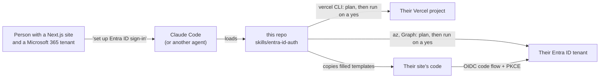
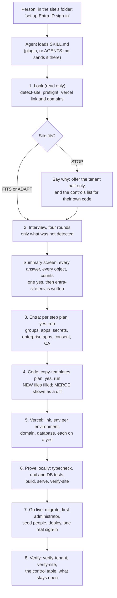

# entra-id-auth: design

A Claude skill that adds Microsoft Entra ID sign-in to a Next.js website on Vercel, end to end:
the groups, the app registrations, consent, optional MFA, the code, the Vercel settings and a
final check. Someone points their AI at this repo, answers a short interview, says yes to each
step, and ends with a working sign-in limited to the people they chose.

Facts about Microsoft and Vercel below were checked on the vendors' own pages on 2026-09-24.

## 1. Context



| Who | Role |
|---|---|
| The person | owns the site; answers the interview; says yes or no to every write |
| Their Microsoft 365 administrator | holds the Entra roles each step needs (may be the same person) |
| The AI | detects, asks, plans, runs only on a yes, reports |
| This repo | the skill, its scripts, the code templates and the control checklist |

## 2. Key choices

| # | Choice | Decision | Why |
|---|---|---|---|
| K1 | Layout | The repo root is both the marketplace and the one plugin (`source: "./"`). The skill lives at `skills/entra-id-auth/`. | One short path for people and for agents; `npx skills add` style tools and plain "read this repo" both find `skills/<name>/SKILL.md` at the root. Tested today with an empty `CLAUDE_CONFIG_DIR`: `claude plugin validate .` checks the marketplace, `claude plugin validate .claude-plugin/plugin.json` checks the plugin and its skill. |
| K2 | Marketplace name | `entra-id-auth` | Same as the repo and the plugin: one name to remember; not a reserved name; carries no person's or company's name. |
| K3 | Plugin and skill name | `entra-id-auth` | Kept: already describes the job; the skill folder name must equal `name`. |
| K4 | Version | in `plugin.json` only, bumped every release; `SKILL.md` carries none | Claude Code updates a user only when the version changes; setting it in two places is reported as a mismatch. `check-skill.sh` fails if `SKILL.md` ever carries a different one. |
| K5 | Metadata owner and author | `BespokeWoodcraftStudio` in `marketplace.json` `owner` and `plugin.json` `author` | `owner.name` is required; `--strict` fails without `author` (tested today). The repo owner is already in every install line. |
| K6 | Portability | `SKILL.md` names paths as `<skill>/scripts/...`, where `<skill>` is the folder holding `SKILL.md` (`${CLAUDE_SKILL_DIR}` in Claude Code). Scripts locate themselves. Frontmatter uses only `name`, `description`, `license`, `compatibility`, `metadata`. | Other agents see `${CLAUDE_SKILL_DIR}` as a literal string. The Agent Skills spec allows only those keys portably. |
| K7 | Entry for "go to this repo and do the setup" | `SETUP.md` is the whole job for an agent sent here: check the machine, install what is missing, sign in, install the plugin (or, for another agent, clone to `~/entra-id-auth`). `AGENTS.md` (with `CLAUDE.md` a symlink) opens with a fork: "asked to do the setup? `SETUP.md`"; "setting up a site? `skills/entra-id-auth/SKILL.md`"; "changing this repo? the rules below". README carries the one-line prompt. | An agent told to read the repo lands on `AGENTS.md` or `README.md` first; both send it to `SETUP.md`, and a site's setup to the one runbook. |
| K8 | Who may sign in | One static security group assigned to the enterprise app, assignment required. | Microsoft's own door; nothing else reaches the site. |
| K9 | No Entra ID P1 | Detected, never silent. Offer: (a) get P1, or (b) create the group anyway as the roster and assign each member directly to the app, mirrored by a rerunnable `sync-assignments` step. The person hears that removal from the group alone does not stop anyone until that step runs again. | Group assignment needs P1. Option (b) keeps "assignment required" and keeps the group meaningful; control M5 reads "PASS (decided)" only when direct assignments equal the roster. The site's own list is the second door for an immediate removal. A job in the site that edits assignments was ruled out: it would put a Graph write credential inside the site. |
| K10 | Roles inside the site | Default: the site's own append-only list (`person_assignments`). Option: an Entra app role `Administrator` assigned to a second group `<Site> Administrators`, read from the id token at each sign-in. | The list records who changed what and applies on the next click. The option lets IT manage admins in Entra; its lag is one session at most. Group claims stay off (200-group overage, control M19). |
| K11 | MFA | Asked every time. The default follows what the tenant already has (section 5, Q12). Never created without a yes; always report-only for a week first. | A public tool should lean secure, and must not add a second policy where security defaults or a tenant-wide MFA policy already apply. |
| K12 | Session length | Asked, with defaults: idle 60 minutes (range 15 to 480, less than the cap), absolute 12 hours (range 1 to 24). One value feeds the code and the CA sign-in frequency. | Different organisations choose differently; one answer keeps the two in step. |
| K13 | The committed record | `docs/auth/entra-record.md` in the site only when the site repo is private (detected) or the person says yes; otherwise `~/.config/<slug>/entra-record.md`. Never a local path. | It holds the tenant id and owners' addresses; a public site repo would publish them. |
| K14 | Previews | Default: previews use the test sign-in lane, not Entra, on their own empty database; each tester's `.invalid` account is made by `scripts/dev-test-user.ts --preview`, which refuses a database holding any real person. Option: one stable branch host with its own registration and secret. | Per-commit preview URLs change every push and can never be registered; wildcards are refused. Any branch's code can read the preview database, so it never holds production's people, not even as a Neon branch copied from production. |
| K15 | Database | Production: the Postgres already on the project; else Neon through the Vercel Marketplace on a yes; else the person supplies a URL. Preview: its own database, created empty and migrated with the same migrations as production, before the first preview and before every later deploy. | Vercel Postgres no longer exists; Neon has a free plan and injects `DATABASE_URL`. A Neon branch per preview is a clone of the production branch by default, so it is not used for previews. |
| K16 | Least privilege | Each step names the smallest role (section 7). Preflight prints what the signed-in admin holds and what is missing. | Strangers' admins should grant only what a step needs. |

## 3. Repo layout

```text
.claude-plugin/marketplace.json   marketplace "entra-id-auth", one plugin, source "./"
.claude-plugin/plugin.json        name, version, description, author, license MIT, keywords
skills/entra-id-auth/
  SKILL.md                        the runbook, under 500 lines
  references/                     interview, config, tenant steps, code, secrets, controls, adapting, lessons
  scripts/                        bash helpers: detect, preflight, tenant-setup, vercel-env, copy, verify
  templates/                      the Next.js + Better Auth + Drizzle code, with its tests
test-harness/                     fills the templates and runs their unit tests in CI
tests/scripts/                    runs every script in plan mode against stub az, vercel and gh
docs/                             DESIGN.md (this), a guide for Microsoft 365 administrators
.github/                          ci.yml, leak and skill checks, dependabot
SETUP.md                          what an agent does when told "go to this repo and do the setup"
README.md  AGENTS.md  CLAUDE.md -> AGENTS.md  LICENSE  SECURITY.md  CONTRIBUTING.md  CHANGELOG.md  .gitignore
```

Install, for people:

```bash
claude plugin marketplace add BespokeWoodcraftStudio/entra-id-auth
claude plugin install entra-id-auth@entra-id-auth
```

Then, in a new session in the site's folder: "Set up Entra ID sign-in on this site" (or
`/entra-id-auth:entra-id-auth`). Without the plugin: clone the repo to `~/entra-id-auth`, outside
every site, and tell the agent to follow `~/entra-id-auth/skills/entra-id-auth/SKILL.md`; never
copy the skill into the site, where its templates would be built and committed with it.

## 4. The flow



Every write, in every step, runs the same rhythm: `plan` prints the exact commands and why, the
agent asks "Run this step? (yes / no / change something)", and only a yes runs it.

## 5. The interview

### Detected first (read only, never asked)

| Value | How |
|---|---|
| Tenant id and name, signed-in admin | `az account show`, Graph `/organization` |
| Verified domains, the default one | Graph `/organization?$select=verifiedDomains` |
| The admin's directory roles | Graph `/me/memberOf` (directory roles) |
| Entra ID P1 or P2 present | Graph `/subscribedSkus`, service plan `AAD_PREMIUM*` |
| Security defaults on | Graph `/policies/identitySecurityDefaultsEnforcementPolicy` |
| An existing tenant-wide MFA policy | Graph `/identity/conditionalAccess/policies` (when readable) |
| Names already taken (apps, groups, policy) | Graph filters on displayName |
| Site stack | `detect-site.sh`: Next version, router, ORM, drivers, auth libraries, Node, tsconfig alias, `.env.local` ignored |
| Vercel team, project, `.vercel.app` host, domains | `.vercel/project.json`, `vercel whoami`, `vercel project ls`, `vercel domains ls` |
| Database already on the project | `vercel env ls` (names only, never values) |
| Site repo visibility | `gh repo view --json visibility` when available; else unknown |

### The questions

Four rounds: Where, Who, What it does, Where it runs. Each question carries "Why we ask", "What
it is about", "What the answer gives us", choices, a recommended default and a blank. A question
the detection answers is shown as a confirmation, not asked.

| # | Question | Why | Default | Sets |
|---|---|---|---|---|
| Q1 | Is this the organisation: `<name>`, `<default domain>`? | every object is pinned to one tenant | the signed-in tenant | `TENANT_ID` |
| Q2 | Which email domains may people use? (only if more than one verified) | the first administrator and seeded people must be on one | all verified except `*.onmicrosoft.com` | `EMAIL_DOMAINS` |
| Q3 | The site's name | shown on sign-in, consent and My Apps; names every Entra object | the Vercel project or `package.json` name, title case | `SITE_TITLE`, `APP_NAME`, `SITE` (slug) |
| Q4 | The production address | the redirect URI, cookie and trusted origin name it exactly | a detected custom domain, else `<project>.vercel.app` | `DOMAIN`; `VERCEL_HOST` only beside a custom domain (empty when `DOMAIN` is the `.vercel.app` host) |
| Q5 | Add that domain to the Vercel project now? (only if missing) | the address must serve the site | yes | `vercel domains add` on a yes |
| Q6 | Who may sign in: a new group, or an existing one? | Microsoft's door is one security group | new group (P1); roster plus direct assignment (no P1) | `GROUP_ID` or `GROUP_NAME`; `ASSIGNMENT_MODE` |
| Q7 | New group: the first members (work addresses). Existing group: put all its members on the site's list now, only the administrators, or let members join on first sign-in? | a new group's members go in the group and on the site's list; an existing group's members are refused by the default `JOIN_MODE=listed` unless listed | new group: the first administrator only; existing group: all of them | `MEMBERS`, or the existing group's choice (and `JOIN_MODE=group` for the third) |
| Q8 | May guests sign in? | guests are outside the organisation's own accounts | no: setup refuses guest addresses, and with `JOIN_MODE=group` the site refuses a first sign-in from an address outside `EMAIL_DOMAINS` | `ALLOW_GUESTS` |
| Q9 | The two owners of every object | nobody leaving orphans them | the signed-in admin and the first administrator; asks for a second if they are one person | `OWNERS` |
| Q10 | The first administrator, and any others | nobody can sign in until one person is on the list | one address; others none | `FIRST_ADMIN`, `EXTRA_ADMINS` |
| Q11 | Where do site roles live: the site's list, or an Entra group? | decides who manages administrators, and how fast removal applies | the site's list | `ROLE_SOURCE`, `ADMIN_GROUP_NAME` |
| Q12 | Should people confirm each sign-in with a second step? | changes how everyone signs in | see below | `REQUIRE_MFA`, `MFA_ANSWERED_BY` |
| Q13 | How long may someone stay signed in? (idle, and absolute) | sets when Microsoft is asked again | 60 minutes idle, 12 hours absolute | `SESSION_IDLE_MINUTES`, `SESSION_MAX_HOURS` |
| Q14 | Does the server need to read Microsoft 365 mail? Which mailboxes? | a separate app, a certificate and an Exchange admin | no | `NEEDS_M365_SERVER`, `MAILBOXES` |
| Q15 | Previews: test lane, Entra on one stable branch host, or none? | preview URLs cannot all be registered | test lane | `PREVIEW_MODE`, `PREVIEW_HOST` |
| Q16 | Test sign-in lane: local and previews, local only, or off? | a password lane helps testing; production never has it | local and previews after Q15 test lane (required); local only after a stable host or none | `PASSWORD_LANE` |
| Q17 | Which Vercel team and project? (only if not linked, or several teams) | env writes go to exactly one project | the linked project | `VERCEL_SCOPE`, `VERCEL_PROJECT` |
| Q18 | Database: the one on the project, a new Neon one, or your own? | the people list and sessions live there | existing if found, else Neon | `DB_SOURCE` |
| Q19 | Keep the setup record in the site's repo? | it holds the tenant id and owners' addresses | yes if the repo is private, no if public or unknown | `RECORD_IN_REPO` |

Shown on the summary as defaults, changed only if asked: `SECRET_MONTHS=11` (1 to 12),
`LOCAL_PORT=3000`, `LOCAL_DATABASE_URL=postgres://localhost:5432/<slug>` (as the OS user, no
password; `user:password@` when the server needs it), `HIDE_FROM_MY_APPS=no`,
`JOIN_MODE=listed` (a group member not on the site's list is refused; `group` adds them on first
sign-in, and needs a yes after the person hears that a Groups Administrator then grants access alone).

**Q12, the MFA default.**

| What preflight found | What is offered | Default |
|---|---|---|
| No P1 | no site policy possible; says whether security defaults are on | nothing to choose |
| Security defaults on | no site policy possible while they are on; the skill never turns them off | nothing to choose |
| A tenant-wide MFA policy already covers these users | "already covered" or a site policy anyway | already covered |
| P1, nothing covers these users | yes (recommended by Microsoft) or no | yes, report-only for a week, then `ca-enable` on a yes |

**Validation, at plan time, before any write.** Every address resolves to an enabled member
account (guests only if Q8 is yes); owners are two different people, compared ignoring case;
an existing group is security-enabled, not mail-enabled, not Microsoft 365, not dynamic, with
no nested groups; hosts are lower case, no scheme, no path, no wildcard; the slug matches
`^[a-z0-9][a-z0-9-]*$`; idle is 15 to 480 minutes and shorter than absolute, which is 1 to 24
hours; `PREVIEW_MODE=test-lane` needs `PASSWORD_LANE=local+preview`; with an existing group, every
administrator is already a member of it. Reports give counts, never lists of names.

## 6. What gets created

### In Entra ID

| Object | Name | When | Shape |
|---|---|---|---|
| Sign-in security group | `<Site>` | new group chosen | static, security, not mail; description carries the marker `entra-id-auth:<DOMAIN>`; two owners added explicitly (an admin creating a group is not made owner) |
| Administrators group | `<Site> Administrators` | `ROLE_SOURCE=entra` | same shape; assigned the `Administrator` app role |
| App registration, production | `<Site>` | always | single tenant; exact https redirects; no implicit grant; `openid profile email` only; no group claims; lock configuration on; two owners; notes carry the marker |
| App registration, local | `<Site> (local)` | always | localhost redirect only; its own secret |
| App registration, preview | `<Site> (preview)` | `PREVIEW_MODE=stable-host` | the one branch host; its own secret |
| Client secrets | one per registration | always | `SECRET_MONTHS` (default 11); to an owner-only file, then Vercel on stdin |
| Enterprise apps | one per registration | always | assignment required; the group assigned (P1), or each roster member (no P1); tenant-wide consent for the three scopes only |
| App role | `Administrator` (value `administrator`) | `ROLE_SOURCE=entra` | the same role id on every sign-in registration; assigned to the administrators group (P1) or named people |
| Conditional Access policy | `<Site>: require MFA` | Q12 yes | these apps only, this group (and the administrators group when `ROLE_SOURCE=entra`, since it holds its own assignment), no exclusions, MFA, sign-in frequency `SESSION_MAX_HOURS`; report-only until `ca-enable`; no marker, recognised by its id in the setup record |
| Reader app, Exchange scope | `<Site> server reader` | Q14 yes | certificate, no Graph permission; Exchange RBAC for named mailboxes, read only |

Takeover guard: an app, group or policy with the same name that lacks this site's marker stops
the run. Using it needs the person's own yes after hearing what will change. A group the person
picked by id is used as is: its description, members and owners are never changed, and the
administrators must already be in it.

### In Vercel

| Thing | Environments | Note |
|---|---|---|
| Project link | | `vercel link --yes --project <name> --scope <team>`, on a yes |
| `DATABASE_URL` | production, preview | production: from the integration or the person. Preview: its own empty database, never production's and never a branch copied from it |
| `BETTER_AUTH_SECRET`, `CRON_SECRET` | each its own | generated; sensitive |
| `BETTER_AUTH_URL`, `NEXT_PUBLIC_APP_URL`, `AUTH_TRUSTED_ORIGINS` | each | set explicitly, never built from `VERCEL_URL` |
| `MICROSOFT_ENTRA_TENANT_ID`, `_CLIENT_ID`, `_CLIENT_SECRET`, `_CLIENT_SECRET_EXPIRES` | production; preview only with its own registration | the production secret never reaches preview |
| `ALLOW_PASSWORD_SIGNIN` | preview and local per Q16 | always `false` in production; the code refuses it there too |
| `M365_READER_*` | production | only with Q14 yes |
| Domain | production | `vercel domains add`, on a yes |
| Neon database | production | `vercel integration add neon`, run from a scratch folder; accepting Marketplace terms the first time needs the person |
| `vercel.json` | | the cron, and a redirect from `.vercel.app` to the custom domain |

### In the site

Better Auth with the Microsoft provider, tenant-pinned, PKCE, no sign-up; `proxy.ts` (Next 16)
or `middleware.ts` (Next 15) with a CSP nonce, which checks the session before any page renders;
the people list (four append-only tables); `requirePagePerson()` first in every signed-in page,
because a layout's redirect does not stop its page from rendering; `requireCurrentPerson()` and
`requireAdministrator()` first in every handler; the sign-in page;
health and credential-expiry cron routes; scripts to add, seed and change people; the tests.

## 7. Roles each step needs

| Step | Least role (Microsoft's list) |
|---|---|
| groups | Groups Administrator |
| app registrations and secrets | Application Developer (creator becomes owner) |
| enterprise apps, assignment, delegated consent | Cloud Application Administrator |
| Conditional Access | Conditional Access Administrator |
| reader Exchange scope | Exchange Administrator |
| everything read only | any member; preflight says which reads were refused |

## 8. Supported stack

| Part | Supported | Otherwise |
|---|---|---|
| Next.js | 16.x App Router: tested | 15.5 or later on 15: ADAPT, writes `middleware.ts` on the Node.js runtime, not tested, maintenance ends about 2026-10-21. 15.0 to 15.4: upgrade to 15.5 or 16 first. 14 or older, Pages Router only: STOP for the code |
| Better Auth | exactly 1.7.6 (1.7.5 also tested) | already installed: merge into the one instance; a later 1.7.x: run the database tests before going live. Another auth library: STOP until the person plans the move |
| Database | Postgres, Drizzle `^0.45.2`, `postgres` or `pg` or Neon driver | Prisma: ADAPT from `adapting.md`, not tested |
| Node | 22.12+ on 22, 24, or 26 and later (`engines: "24.x"` recommended) | 20 or older: STOP with the fix |
| Host | Vercel | another host: code and tenant steps run; Vercel steps print the names to set in that host's store |
| Setup machine | macOS or Linux, bash, `az`, `vercel`, `node`, `psql`, and a local Postgres 15+ server whose user may create databases (step 6) | Windows: through WSL only |
| Tenant | Microsoft 365 with Entra ID; P1 for groups on the app and for CA | no P1: K9; single tenant only (no B2C, no External ID, no multi-tenant) |

When a site does not fit, the tenant half and the control checklist still apply, and the skill
says exactly which part it will not do.

## 9. Interfaces between the parts

The config file `~/.config/<slug>/entra-site.env` (chmod 600, answers only, no secrets) is the
one contract between the interview, the scripts and the templates. `entra-state.env` beside it
holds the ids the steps create.

| Kind | Names |
|---|---|
| Config keys | `SITE SITE_TITLE APP_NAME DOMAIN VERCEL_PROJECT VERCEL_HOST VERCEL_SCOPE SITE_DIR TENANT_ID EMAIL_DOMAINS` (comma list) `GROUP_ID GROUP_NAME GROUP_NICK MEMBERS OWNERS FIRST_ADMIN FIRST_ADMIN_NAME EXTRA_ADMINS ASSIGNMENT_MODE` (group, direct) `ROLE_SOURCE` (site, entra) `ADMIN_GROUP_ID ADMIN_GROUP_NAME ALLOW_GUESTS` (no) `JOIN_MODE` (listed, group) `LIST_GROUP_MEMBERS` (all, admins; required with `GROUP_ID`) `REQUIRE_MFA MFA_ANSWERED_BY SESSION_IDLE_MINUTES` (60) `SESSION_MAX_HOURS` (12) `SESSION_ANSWERED_BY NEEDS_M365_SERVER MAILBOXES EXCHANGE_ROLE PASSWORD_LANE` (local+preview, local, off) `PREVIEW_MODE` (test-lane, stable-host, none) `PREVIEW_HOST DB_SOURCE` (existing, neon, other) `LOCAL_PORT LOCAL_DATABASE_URL SECRET_MONTHS ADOPT_EXISTING_APPS HIDE_FROM_MY_APPS RECORD_IN_REPO` |
| Template placeholders | `__SITE_NAME__ __EMAIL_DOMAINS__ __DOMAIN__ __VERCEL_HOST__ __SRC_ROOT__ __SESSION_IDLE_MINUTES__ __SESSION_MAX_HOURS__ __ROLE_SOURCE__ __JOIN_MODE__ __ALLOW_GUESTS__`. Each sits inside a string literal, so a raw template still parses; `settings.ts` parses and range-checks the numbers and throws at import on a bad value |
| Seed file | `~/.config/<slug>/people.json` (chmod 600): `[{oid, email, name, role}]`, written by the `group` and `admin-group` steps from resolved members, read by the site's `scripts/seed-people.ts` |
| Tenant steps | `group admin-group app secret sp consent ca ca-enable reader reader-exchange sync-assignments record`, plus `teardown` (prints delete commands, never runs them) |
| Control rows that read the answers | M20: app roles are exactly `Administrator`, assigned only to the administrators group or named people; N/A when `ROLE_SOURCE=site`. M5 accepts "PASS (decided)" for `ASSIGNMENT_MODE=direct` when assignments equal the roster; M16 "PASS (decided)" with `ALLOW_GUESTS=yes`; C16 and C17 check the configured numbers; M17 checks the record where `RECORD_IN_REPO` put it |

## 10. Security

| Risk to a stranger | Guard |
|---|---|
| The AI changes their tenant unasked | every write is `plan`, then a yes, one step per question; `plan` with no step is the full dry run; read-only phases work in plan mode |
| Wrong tenant or wrong Vercel project | `TENANT_ID` pinned after Q1; every tenant script refuses any other. `vercel-env.sh` refuses unless the folder is linked to `VERCEL_PROJECT` |
| Taking over someone else's object | the name marker check on apps, groups and the CA policy; adoption only on the person's own yes |
| Secrets leaking | generated straight into owner-only files, to Vercel on stdin, never printed, never read into the conversation, never committed |
| Personal data leaking | counts not names in output; the record kept out of a public site repo; no local paths written anywhere |
| Over-broad access | single tenant, exact redirects, no wildcards, three scopes, assignment required, no group claims, two doors (Microsoft, then the site's list) |
| Excess privilege | least role per step; the reader is read-only on named mailboxes |
| A site file that tells the AI what to do | the site's files are data; the skill follows only `SKILL.md` |
| Running with permissions bypassed | the skill still asks every yes in chat and says so at the start |
| Deleting things | the skill never deletes a tenant object; `teardown` only prints |
| This repo's own supply chain | pinned package ranges, SHA-pinned CI actions, no piped install scripts, a leak check on every push |

## 11. Scope

| In | Out, and why |
|---|---|
| Workforce sign-in for one tenant | customers, B2C, External ID, multi-tenant: a different design |
| Creating and checking the groups | nested groups (not honoured for app assignment); dynamic groups (membership is not the site's to set) |
| Optional app-role administrators | group claims (overage, and nothing in the token is needed) |
| Next.js App Router on Vercel | other frameworks: tenant half and checklist only |
| Client secrets, 11 months, renewal warnings | certificates or federated credentials for sign-in: documented as the stronger path, a later release |
| Optional MFA policy for these apps | tenant-wide policy, security defaults: the organisation's, never touched |
| Seeding and script-based people changes | a people admin screen: each site builds its own |
| Printing a teardown | running a teardown |
| macOS, Linux, WSL | native Windows shells |

## 12. Risks

| Risk | Effect | Handling |
|---|---|---|
| A vendor CLI or API changes | a step fails | each step fails closed with a `STOP:` line; version ranges and "tested with" in the README; CI on a schedule |
| Next 15 leaves maintenance | adopters on 15 lose support | 15 stays ADAPT with the date shown; 16 is the path |
| Better Auth 1.8 changes hooks, or a 1.7.x patch changes what the hooks see | the gate or the sign-in log could misbehave | sites install exactly 1.7.6 and setup flags any range; the unit tests and the database tests (the real Better Auth pipeline against Postgres) run in CI against the locked version and against the newest 1.7.x, weekly and on every change |
| No P1 | the group cannot be assigned | K9, stated before any write |
| The skill name is not checked against its folder by `claude plugin validate` (tested today) | a rename breaks Agent Skills clients | `.github/scripts/check-skill.sh` checks name, folder, frontmatter keys and length |
| The site repo is public | the record exposes addresses | K13 |
| Wide admin role used anyway | more power than needed during setup | preflight names the least role per step |
| Node 26 on Vercel Functions not confirmed | a build on 26 may not deploy | recommend `24.x` |
