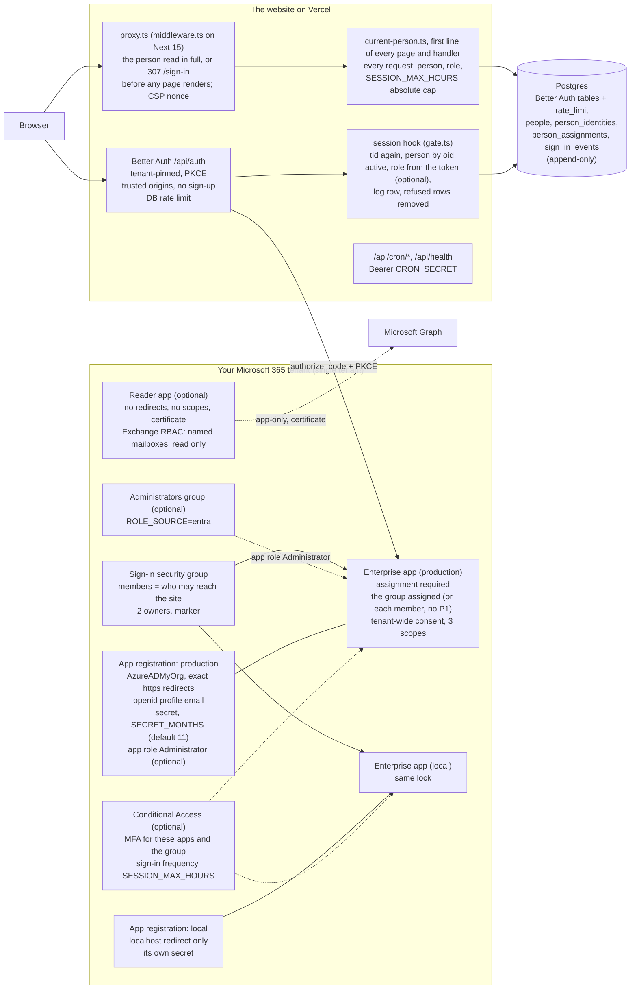

# What gets built

One site, one tenant. Dotted boxes are optional and appear only when the interview says so.

## Three doors

| Door | Where | Refuses | Instant? |
|---|---|---|---|
| 1. Microsoft | tenant | another tenant; anyone not assigned (not in the group); no MFA, only where the person asked for it | yes, at sign-in |
| 2. Session hook | `gate.ts` | foreign `tid`; not on the people list (unless `JOIN_MODE=group`, and then, with `ALLOW_GUESTS=no`, an address outside the organisation's domains); switched off; a second account claiming a bound email | yes, no session made |
| 3. Every request | `current-person.ts`: in the proxy, then first in every page (`requirePagePerson()`) and handler | switched off since sign-in; idle past `SESSION_IDLE_MINUTES`; session past `SESSION_MAX_HOURS` | yes, next click |

Microsoft decides who can reach the site. The people list decides what they may do there. Both are
needed: a Groups Administrator can add anyone to the group, and with `JOIN_MODE=listed` the list
still refuses them.

## Session caps are settings

| Setting | Default | Range | Feeds |
|---|---|---|---|
| `SESSION_IDLE_MINUTES` | 60 | 15 to 480, and less than the absolute cap | `settings.ts`; the keep-alive renews an active tab |
| `SESSION_MAX_HOURS` | 12 | 1 to 24 | `settings.ts`, `current-person.ts`, and the Conditional Access sign-in frequency |

One answer feeds both the code and the policy, so they never disagree. After the absolute cap the
next sign-in goes back through Microsoft, which checks the account and the group again.

## Who sees what

| Caller | Gets | Cannot |
|---|---|---|
| A stranger | `/sign-in` (no live data), `{"ok":true}` from health | any page's content, even with a made-up session cookie (C26); a token (single tenant), cron, sign-up, the password lane in production; search engines are told not to index |
| A tenant account outside the group | nothing: Microsoft refuses at sign-in | reach the site at all |
| A group member not on the list | a Microsoft sign-in, then `/sign-in?error=refused_not_on_the_list` (with `JOIN_MODE=listed`) | a session; their user rows are removed |
| A listed member | their pages, by role | administrator writes |
| A listed administrator | everything, plus people and roles | leave the site with no administrator |
| Vercel cron | `/api/cron/*`, health details, with the bearer | any page |
| The reader app | the named mailboxes, read only | any other mailbox (403), any directory data |

## Objects, per site

| Object | Name | When | Count |
|---|---|---|---|
| Sign-in security group | `<Site>` (or an existing one, by id) | always | 1 |
| Administrators group | `<Site> Administrators` | `ROLE_SOURCE=entra` | 0 or 1 |
| App registration + enterprise app | `<Site>`, `<Site> (local)`, and `<Site> (preview)` | preview only with `PREVIEW_MODE=stable-host` | 2 or 3 of each |
| Client secret | one per registration | always | 2 or 3 |
| App role | `Administrator` (value `administrator`) on each sign-in registration | `ROLE_SOURCE=entra` | 0 or 1 per registration |
| Direct assignments | one per roster member, per enterprise app | `ASSIGNMENT_MODE=direct` (no P1) | as many as the roster |
| Conditional Access policy | `<Site>: require MFA` | `REQUIRE_MFA=yes` | 0 or 1 |
| Reader app + enterprise app | `<Site> server reader` | `NEEDS_M365_SERVER=yes` | 0 or 1 |
| Exchange scope and role assignment | `<slug>, named mailboxes only` | `NEEDS_M365_SERVER=yes` | 0 or 1 each |
| Vercel settings | see [secrets-and-settings.md](secrets-and-settings.md) | always | |
| Tables | 5 Better Auth, 4 access | always | 9 |

Every Entra object carries the marker `entra-id-auth:<DOMAIN>` and two owners.

## Where roles live

By default, roles live in the site's own append-only list (`person_assignments`): every change says
who made it and when, and applies on the next click. Nothing in the token needs reading, and group
claims stay off, so there is no 200-group overage (control M19).

With `ROLE_SOURCE=entra`, IT manages administrators in Entra instead. Each sign-in registration
defines one app role, `Administrator`, assigned to the `<Site> Administrators` group (or, with no
P1, to named people). The session hook reads the id token's `roles` claim at each sign-in and
appends a role row when it differs from the list. A change in Entra therefore applies at the next
sign-in, one session at most (`SESSION_MAX_HOURS`). The site's list still records who holds which
role and when. Group claims stay off either way (control M20 checks the app role).
