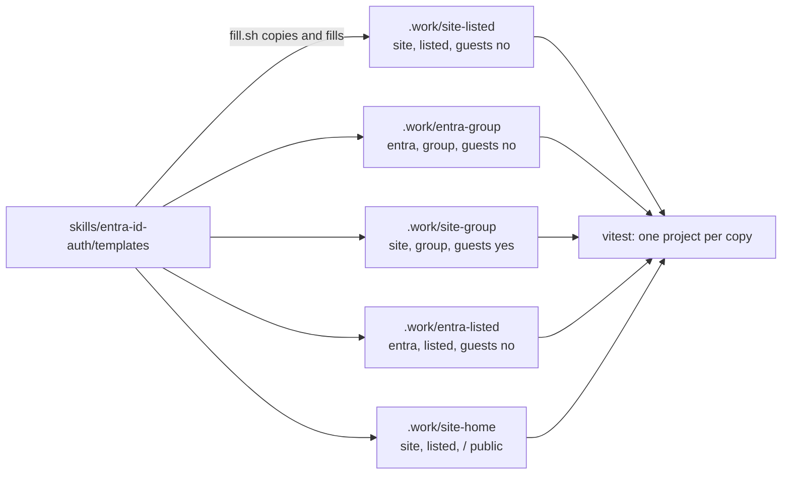

# Test harness

Proves the code templates in `skills/entra-id-auth/templates/` work, without touching a real
Microsoft 365 tenant, Vercel project or website.

## What it does



- `fill.sh` copies the templates five times into `.work/` and fills every placeholder with values that are
  plainly not real. It stops if any `__NAME__` placeholder is left unfilled.
- Four copies cover every `ROLE_SOURCE` and `JOIN_MODE` pair. The two `JOIN_MODE=group` copies
  take each `ALLOW_GUESTS` value, the only mode where it decides a sign-in. A fifth, `site-home`,
  is the first with `/` added to `PUBLIC_PATHS`, as a site with a public landing page has it.
- `vitest.config.mts` runs the templates' own tests once per copy.

| Placeholder | Filled with |
|---|---|
| `__SITE_NAME__` | `Contoso Portal` |
| `__EMAIL_DOMAINS__` | `contoso.com,fabrikam.com` |
| `__DOMAIN__` | `portal.contoso.com` |
| `__VERCEL_HOST__` | `contoso-portal.vercel.app` |
| `__SRC_ROOT__` | `src` |
| `__SESSION_IDLE_MINUTES__` | `60` |
| `__SESSION_MAX_HOURS__` | `12` |
| `__ROLE_SOURCE__` | `site` or `entra`, per copy |
| `__JOIN_MODE__` | `listed` or `group`, per copy |
| `__ALLOW_GUESTS__` | `no`, except `yes` in `site-group` |

## Commands

Run from this folder, on Node 22 (22.12 or later), 24, or 26 or later. Node 25 is not supported.

| Command | What it runs |
|---|---|
| `npm ci && npm test` | fill, then every unit test against all five copies, then `tsc` over each (CI runs this) |
| `npm run typecheck` | fill, then `tsc` over all five copies |
| `npm run test:db` | the database test; see below |

## The database test

`db.integration.test.ts` needs a real Postgres. It checks the append-only tables, the
last-administrator race, the session cap, seeding people, and both `ROLE_SOURCE` and `JOIN_MODE`.

```bash
TEST_DATABASE_URL=postgres://localhost:<port>/<empty database> npm run test:db
```

- On macOS a throwaway server started under a long folder path can fail to make its socket
  (the path limit is 103 bytes). Start it with `-c unix_socket_directories=` (TCP only) or a short
  folder; the database test connects over TCP.
- The database must be on this machine (`localhost` or `127.0.0.1`). Anything else is refused before
  it is touched.
- Use an empty, throwaway database. `db.sh` refuses one that holds any table other than the test's
  own (read from the template schema), because `drizzle-kit push --force` would drop it; a rerun on
  its own tables still works. It creates the tables with `drizzle-kit push`, adds the
  append-only triggers, then runs the test once per copy, clearing Better Auth's rate-limit counters
  before each.
- With no `TEST_DATABASE_URL`, it says so and runs nothing.

`.work/` and `node_modules/` are never committed.
